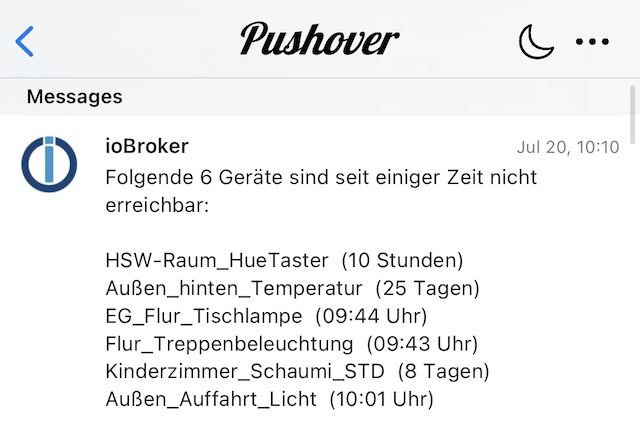
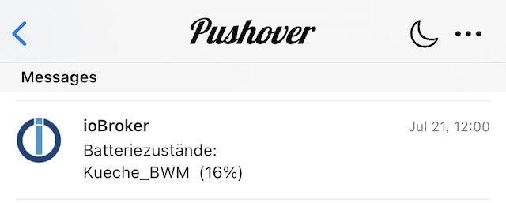

# ioBroker.device-watcher

 

 
**Version:**  

 
**Tests:**  

## Sentry

**This adapter uses Sentry libraries to automatically report exceptions and code errors to the developers.** For more details and for information how to disable the error reporting see [Sentry-Plugin Documentation](https://github.com/ioBroker/plugin-sentry#plugin-sentry)! Sentry reporting is used starting with js-controller 3.0.

## Documentation

🇬🇧 [Documentation](/docs/en/README.md) 
🇩🇪 [Dokumentation](/docs/de/README.md)

## Discussion and Questions

[ioBroker Forum](https://forum.iobroker.net/topic/55426/test-adapter-device-watcher-v1-x-x-github-latest) 
[ioBroker Discord Channel](https://discord.com/channels/743167951875604501/1030196924944486530)

## Device-Watcher adapter for ioBroker

This is a watchdog for devices. The adapter looks for the rssi/link quality and battery states and create JSON & HTML lists of them (devices with battery, devices with low battery, devices with link quality, devices offline and devices all) and count the devices in the same categories. For example you can use the lists and states for Grafana, Jarvis etc.

**Supported adapters:**

| - Alexa2 - Ble - Deconz - Enocean - ESPHome - FritzDect - HAM - Harmony - HmiP - Homematic - HS100 - Hue - Hue Extended - Jeelink | - Lupusec - MaxCube - Meross - MiHome - MiHome Vacuum - Netatmo - Nuki Extended - NUT - Ping - Roomba - Shelly - Sonoff - Sonos - Switchbot Ble | - Tado - Tradfri - Unifi - WLED - Yeelight - Zigbee - Zigbee2MQTT - Zwave |
| ------------------------------------------------------------------------------------------------------------------------------------------------------------------------ | -------------------------------------------------------------------------------------------------------------------------------------------------------------------------------------- | ---------------------------------------------------------------------------------------------- |

**If one adapter is missing, feel free to open an [issue](https://github.com/ciddi89/ioBroker.device-watcher/issues/new/choose) with request to add it.**

The adapter has also the option to send notifications if the number of offline devices are changed and to send you a notification if devices has a low battery state (e.g. 30%). You can choose the value for the battery notification and on which days you want the notification for low batteries.

Currently supported notification services are:

-   Telegram (with support of Chat-ID for groupchats)
-   Pushover
-   WhatsApp
-   Email
-   Jarvis
-   Lovelace
-   and also an datapoint with the last notification, so you can use it for other services which aren't supported.

If you found a bug or you have an improvement suggestion, feel free to open an issue.

### Blacklist

If you don't want a specifice device in the list, you can add it in the blacklist and the adapter will ignore it.

### Example images of Pushover notification:

### Here are some images how the lists look:

## To-Do

-   [ ] clean up the code
-   [ ] add support for reaction on state-changes
-   [ ] send offline text only from the device that goes offline

## Changelog

<!--
    Placeholder for the next version (at the beginning of the line):
    ### **WORK IN PROGRESS**
-->

### **WORK IN PROGRESS**

-   fixed issue with localCompare
-   added tapo
-   (Scrounger) added fullyBrowser adapter

### 2.0.2 (2022-11-12)

-   added status to battery list
-   batt devices which are offline are now still included in the battery list
-   small improvements of translations
-   offline time settings: you can use 0 instead of -1 (it will be the new standard)
-   improvements of adaptername
-   fixed issues [#66](https://github.com/ciddi89/ioBroker.device-watcher/issues/66) & [#67](https://github.com/ciddi89/ioBroker.device-watcher/issues/67)
-   repaired blacklist notifications
-   added handling for blacklist object

### 2.0.1 (2022-11-02)

-   If the device is offline, set signal strength to '0%'
-   If the device is offline, set battery to ' - '
-   repair some small issues in the lists

### 2.0.0 (2022-11-01)

-   added Lupusec, HS100 adapter, Zigbee2MQTT and MaxCube
-   changed name of Homematic to HM-RPC
-   made a completly makeover of the blacklist
-   clean up the code and shorten some

### 1.1.0 (2022-10-03)

-   removed indicatoren for daily sent messages
-   changed selector for shelly devices
-   added Zigbee2MQTT adapter
-   added cron function to use own time for daily overview messages

### 1.0.1 (2022-09-30)

-   added WLED, Ikea Tradfri, Roomba, HmIp, Tado, Netatmo, Yeelight-2, Unifi, Nut and Meross adapter
-   fixed battery message
-   corrected and repaired some issues of last contact time
-   added support for old HM devices
-   some small refactoring of code
-   changed shelly selector from dp rssi to dp online

### 1.0.0 (2022-09-03)

-   ** BREAKING CHANGE ** If you update from version <= 0.3.0, remove the old instance first before you update to >= 1.0.0. After that you can create a new instance.
-   changed mode from shedule to daemon, please take aware from the advice above
-   added Logitech Harmony Hub
-   small bugfixes (own function for blacklist, fix for memory leak etc.)

### 0.3.0 (2022-08-10)

-   removed channelnumber in Homematic devices name
-   added function to create html list
-   added german and english documentation

### 0.2.4 (2022-07-31)

-   many changes of code, comments and error handling

### 0.2.2 (2022-07-28)

-   fixed translations
-   added sentry
-   added nuki battery state

### 0.2.1 (2022-07-27)

-   removed test states

### 0.2.0 (2022-07-24)

-   added function to create data of each adapter

### 0.1.2 (2022-07-22)

-   improved overview of admin ui
-   added option in admin ui to create own folders for each adapter (!!not working yet!!)

### 0.1.1 (2022-07-22)

-   changed wrong type of datapoint lastCheck
-   added possibility to choose own offline time for each adapter
-   added Whatsapp notification services
-   improved sonoff devices
-   added row with online and offline status in table allDevices
-   added alexa2 and esphome devices
-   Added priority for pushover notifications

### 0.0.8 (2022-07-05)

-   added own notes field for blacklist
-   added ping, switchbot ble, mihome, sonos, fritzdect, hue, hue extended and nuki extended
-   some improvements of code

### 0.0.6 (2022-06-10)

-   added Homematic, Deconz, Zwave
-   added Email notification
-   added count and list for low battery devices
-   changes Log state dp to last notification state dp
-   Using available state instead of link quality state for zigbee devices
-   Show the correct time of last contact instead the minutes if the time is under 100minutes
-   small bugfixes

### 0.0.5 (2022-06-05)

-   added admin translations

### 0.0.3 (2022-06-05)

-   added Shelly and Sonoff Devices

### 0.0.2 (2022-06-05)

-   Release for testing

### 0.0.1 (2022-05-01)

-   initial release

## License

MIT License

Copyright (c) 2022 Christian Behrends <mail@christian-behrends.de>

Permission is hereby granted, free of charge, to any person obtaining a copy
of this software and associated documentation files (the "Software"), to deal
in the Software without restriction, including without limitation the rights
to use, copy, modify, merge, publish, distribute, sublicense, and/or sell
copies of the Software, and to permit persons to whom the Software is
furnished to do so, subject to the following conditions:

The above copyright notice and this permission notice shall be included in all
copies or substantial portions of the Software.

THE SOFTWARE IS PROVIDED "AS IS", WITHOUT WARRANTY OF ANY KIND, EXPRESS OR
IMPLIED, INCLUDING BUT NOT LIMITED TO THE WARRANTIES OF MERCHANTABILITY,
FITNESS FOR A PARTICULAR PURPOSE AND NONINFRINGEMENT. IN NO EVENT SHALL THE
AUTHORS OR COPYRIGHT HOLDERS BE LIABLE FOR ANY CLAIM, DAMAGES OR OTHER
LIABILITY, WHETHER IN AN ACTION OF CONTRACT, TORT OR OTHERWISE, ARISING FROM,
OUT OF OR IN CONNECTION WITH THE SOFTWARE OR THE USE OR OTHER DEALINGS IN THE
SOFTWARE.
